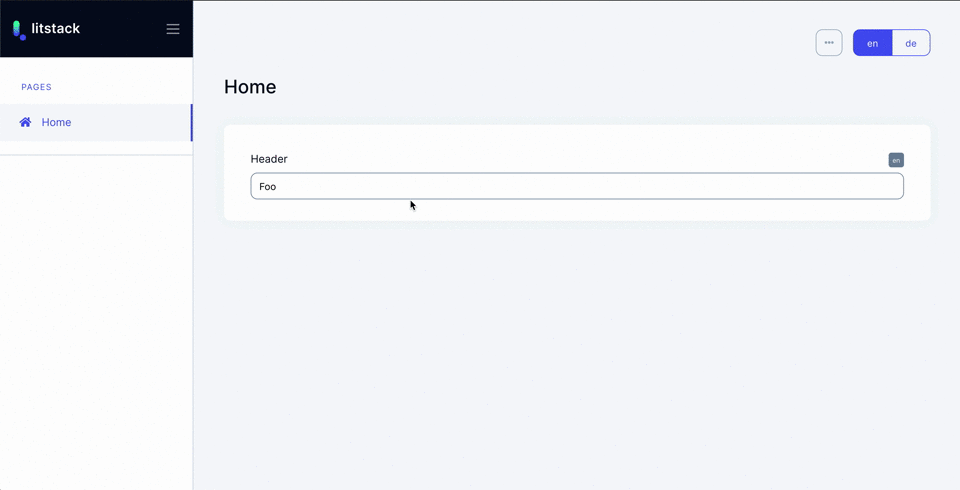

# 2 Factor Authentication

<!--
<iframe src="https://github.com/sponsors/litstack/card" title="Sponsor litstack" height="100" width="100%" style="border: 0;" class="github-sponsor"></iframe>
-->

## Introduction

A package to add 2 Factor Authentication to your litstack application. Secure
the login or the submitting of forms.

## The verify Field

With the verify field a form can be confirmed with a one time password become.

```php
$form->input('header');

$form->needsVerification();
```



::: tip

If the authenticated user hasn't activated 2 factor authentication for his
account. He is asked to verify the form using his password.

:::

<!--
## Sponsorware

Litstack pages was created by
**[Lennart Carstens-Behrens](https://twitter.com/lennartcb)** under the
**[Sponsorware license](https://github.com/sponsorware/docs)**.
-->

## Setup

<!--
Add the Litstack repository to your application's composer.json file:

```json
"repositories": [
    {
        "type": "composer",
        "url": "https://store.litstack.io"
    }
],
```
-->

Install the package via composer:

```shell
composer require litstack/2fa
```

## User Model

Too enable 2 factor authentication on the model used for the litstack
authentication it must add the 2 columns to the corresponding table:

```shell
pa make:migration add_two_fa_columns_to_lit_users_table
```

```php
class AddTwoFaColumnsToLitUsersTable extends Migration
{
    public function up()
    {
        Schema::table('lit_users', function (Blueprint $table) {
            $table->boolean('two_fa_enabled');
            $table->string('two_fa_secret');
        });
    }

    public function down()
    {
        Schema::table('lit_users', function (Blueprint $table) {
            $table->dropColumn('two_fa_enabled');
            $table->dropColumn('two_fa_secret');
        });
    }
}
```

Execute the migraton:

```shell
php artisan migrate
```

Now your Model needs to implement the `Litstack\TwoFA\Authenticatable` contract
and use the `Litstack\TwoFA\HasTwoFactorAuthentication` trait:

```php{lit/app/Models/User.php}
// ...

use Litstack\TwoFA\Authenticatable  as TwoFA;
use Litstack\TwoFA\HasTwoFactorAuthentication;

class User extends Authenticatable implements CanResetPasswordContract, TwoFA
{
    use HasTwoFactorAuthentication;

    // ...
}
```

The final thing you need to do, is adding the `two_fa_secret` to the `hidden`
attributes of your model and the `two_fa_enabled` as a **boolean** `cast` like
this:

```php{lit/app/Models/User.php}
/**
 * Hidden attributes.
 *
 * @var array
 */
protected $hidden = ['password', 'two_fa_secret'];

/**
 * The attributes that should be cast to native types.
 *
 * @var array
 */
protected $casts = [
    'email_verified_at' => 'datetime',
    'two_fa_enabled'    => 'boolean',
];
```
