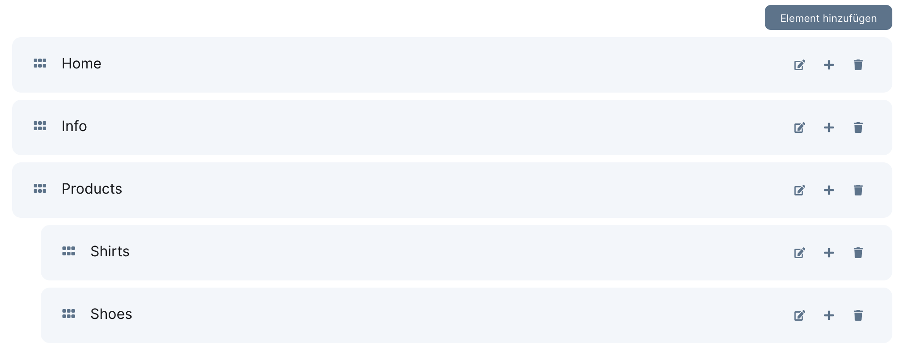
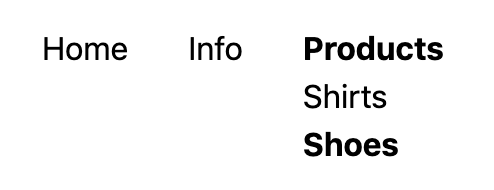

# Bladesmith

## Sponsorware

Bladesmith was created by
**[Lennart Carstens-Behrens](https://twitter.com/lennartcb)** under the
**[Sponsorware license](https://github.com/sponsorware/docs)**.

::: tip

Read the [sponsorware](../prologue/sponsorware.md) section to learn how to get
access to this package.

:::

## Introduction

A package with helper functions and Blade components for your
[Litstack](https://github.com/litstack/litstack) project.

## Setup

Add the Litstack repository to your application's composer.json file:

```json
"repositories": [
    {
        "type": "composer",
        "url": "https://store.litstack.io"
    }
],
```

```shell
composer require litstack/bladesmith
```

To include all styles and scripts the `x-styles` tag must be placed in the head
and the `x-scripts` tag at the end of the body.

```html
<!DOCTYPE html>
<html lang="en">
	<head>
		...

		<x-styles />
	</head>
	<body>
		...

		<x-scripts />
	</body>
</html>
```

## Image

The image component uses lazy loading to preview a base64 string of the image
before loading it. The image will be loaded when it gets scrolled into the
screen. The component also outputs the appropriate media conversion for the
corresponding screen sizes.

The component requires an image parameter with a media model:

```php
<x-lit-image :image="$model->image"/>
```


Lazy loading may disabled by setting the `lazy` attribute to false:

```php
<x-lit-image :image="$model->image" :lazy="false" />
```

## Building Navigations in Litstack

Every page needs a navigation. Building it often takes time, especially if the
design has to be adapted exactly to your needs. The Ui kit comes with a simple
extensive solution to include all possible navigations types that are built with
a `list` field in a short time.

### Create the Form

We start by creating a form in that we can build our navigation:

```shell
php artisan lit:form --collection=navigations --form=main_navigation
```

The next step is to add a `nav` field to the newly created config file:

```php
namespace Lit\Config\Form\Navigations;

class MainNavigationConfig extends FormConfig
{
	public function show(CrudShow $page)
    {
        $page->card(function ($form) {
            $form->nav('main')->title('Main Navigation')->maxDepth(3);
        });
    }
}
```

<p align="center">
	
</p>

Now we can simply pass the list field to the `x-fj-nav-list` component and a
navigation is created that can be build in the fjord backend:

### Display the Navigation

```php
use Fjord\Support\Facades\Form;

$nav = Form::load('navigations', 'main_navigation');

<x-fj-nav-list :list="$nav->main" layout="horizontal" dropdown/>
```

This will result in the following simple horizontal navigation:

<p align="center">
	
</p>

Customize the navigation using the following options

| Method        | Description                                                            |
| ------------- | ---------------------------------------------------------------------- |
| `layout`      | Can be `horizontal` or `vertical`. (default is `vertial`)              |
| `dropdown`    | Wether the navigation should be a dropdown menue on `mouseover`.       |
| `depth`       | Max depth.                                                             |
| `subLevel`    | Start depth.                                                           |
| `expandable`  | Only display's level one, all child levels can be expanded on `click`. |
| `class`       | Navigation class.                                                      |
| `activeClass` | Class of active items. (default is: `fj--active`)                      |

## Translatable Routes

Build translated routes in the form of `/en/home`, `/de/startseite` made easy.

Make shure to translate your routes within your translation-files in the
`resources` directory, for example:

```php
// lang/de/routes.php

return [
    'home' => 'startseite'
];
```

You can now simply add translated Routes to your preferred routes file using the
`__()` helper in the uri string like this:

```php
Route::trans('/__(routes.home)', 'HomeController@show')->name('home');
```

A translated route will be created for all locales defined in your
`translatable` config. The locale will be prepended to the given **uri** and
**name**. So the routes for the previous example would be:

-   `en.home` => `/en/home`
-   `de.home` => `/de/startseite`

The `__route` helper prepends the current locale to the given name and returns
the corresponding route:

```php
<a href="{{ __route('home') }}">
    ...
</a>
```

### Switching Languages

You may want to place a link to the different language route on your website. To
do this, the `translate` method can be applied to the current route with the
desired locale.

```php
<a href="{{ Request::route()->translate('de') }}">Deutsch</a>
```

#### With Parameters

For routes with parameters a translator must be specified. A translator is a
controller method that returns the route parameters for the desired locale. The
translator method receives the desired locale and the parameters for the current
locale.

```php
// ./routes/web.php
Route::trans('/{slug}', 'MyController@show')->translator('getSlug')->name('home');

// ./app/Http/Controllers/MyController.php

...

class MyController extends Controller
{
	...

	public function getSlug($locale, $slug)
	{
		$slug = Post::whereTranslation('slug', $slug)
			->first()
			->translate($locale)
			->slug;

		return ['slug' => $slug];
	}
}
```

### Language Switch

The Blade componend `x-fj-localize` creates a link to the translated routes of
all locales.

```html
<x-fj-localize />
```

Result:

```html
<a href="/en/home" class="locale locale-en locale-active">EN</a>
<a href="/de/startseite" class="locale locale-de">DE</a>
```

You may change the content of the link By passing a slot with the name of the
locale:

```html
<x-fj-localize>
	<x-slot name="en">
		English
	</x-slot>
	<x-slot name="de">
		Deutsch
	</x-slot>
</x-fj-localize>
```

Result:

```html
<a href="/en/home" class="locale locale-en locale-active">English</a>
<a href="/de/startseite" class="locale locale-de">Deutsch</a>
```

## Helpers

### `child_is_active`

The child is active determines wether a list item has a child with an active
route. The following example will add the `is-active` class when a list item has
an active `route` that is added from route field.

```php
$form->route('route_field')->collection('app')->title('Pick a route.');
```

```php
@foreach($data->list as $item)
	<span class="child_is_active($item, 'route_field', 'is-active')">
		{{ $item->title }}
	</span>
@endforeach
```

## Customize Views

If you want to customize the blade components, you can simply publish them and
edit them as desired.

```shell
php artisan vendor:publish --provider="Litstack\Bladesmith\BladesmithServiceProvider" --tag=views
```
