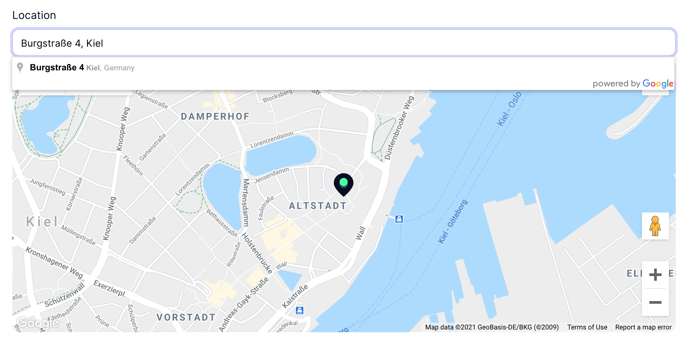

# Location

<iframe src="https://github.com/sponsors/litstack/card" title="Sponsor litstack" height="100" width="100%" style="border: 0;" class="github-sponsor"></iframe>

## Introduction

The location package ships with a google maps field that let's you benefit from
the extensive places api, to search for location's or pick one from the map.



## Sponsorware

Bladesmith was created by
**[Lennart Carstens-Behrens](https://twitter.com/lennartcb)** under the
**[Sponsorware license](https://github.com/sponsorware/docs)**.

::: tip

[Sponsor litstack](https://github.com/sponsors/litstack) to get access to this
package.

:::

## Setup

Add the Litstack repository to your application's composer.json file:

```json
"repositories": [
    {
        "type": "composer",
        "url": "https://store.litstack.io"
    }
],
```

```shell
composer require litstack/location
```

### Get A Google Api Key

Now you need to get an api key to make use of google maps in your litstack
project.

-   Go to the
    [Google credentials page](https://console.cloud.google.com/projectselector2/apis/credentials).
-   Create an Api Key.
-   Enable the following
    [libraries](https://console.cloud.google.com/apis/library) for your newly
    generated API Key
    ([Maps Javascript API](https://console.cloud.google.com/apis/library/maps-backend.googleapis.com),
    [Places API](https://console.cloud.google.com/apis/library/places-backend.googleapis.com))

The api key must now be added to your config under
`lit.location.google_api_key`:

```php{config/lit.php}
'location' => [
	'google_api_key' => env('GOOGLE_MAPS_API_KEY'),
],
```

## Maps Field

The maps field let's the user pick location by searching for it or clicking
somewhere on the map.

The map field requires 2 parameters, the first one is the name of the latitude
attribute, the second parameter is the longitude attribute name.

```php
$form->map('lat', 'lng');
```

### Store Place Attributes

The maps field let's you store additional information about places to your
Model. This can be achieved by passing an array as a third parameter to the maps
field, containing the desired attributes and the database column in which the
attribute should be stored. In the following example the `formatted_address`
would be stored in the `street` column.

```php
$form->map('lat', 'lng', [
	'formatted_address' => 'street',
]);
```

The following attributes are available:

| Method              | Description                   |
| ------------------- | ----------------------------- |
| `formatted_address` | The formatted address name.   |
| `street_number`     | The location's street number. |
| `street_name`       | The location's street name.   |
| `state`             | The location's state.         |
| `city`              | The location's city name.     |
| `country`           | The location's country.       |
| `postal_code`       | The location's postal code.   |
